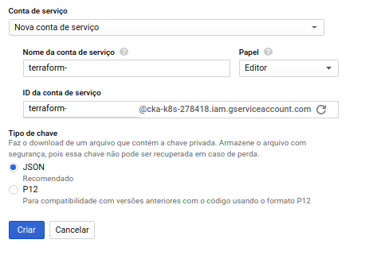
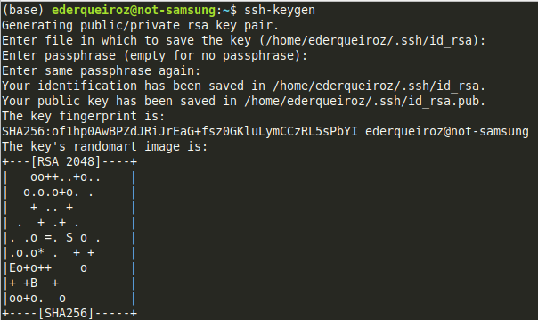
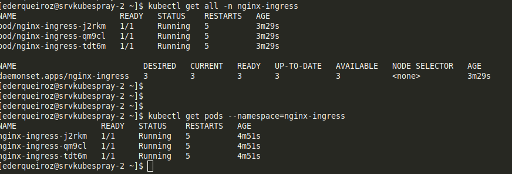
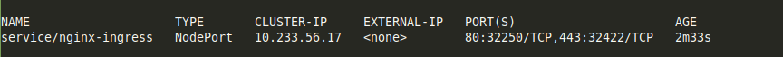
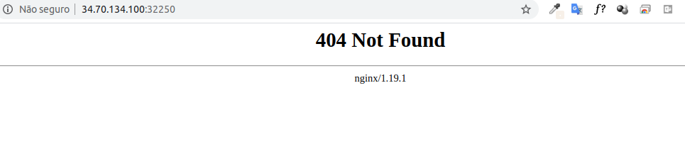

# Cluster Kubernetes

- [Cluster Kubernetes](#cluster-kubernetes)
      - [Pré-Requisitos:](#pré-requisitos)
      - [Introdução](#introdução)
  - [1. Download do terraform:](#1-download-do-terraform)
  - [2. Preparando o GCP para o Terraform](#2-preparando-o-gcp-para-o-terraform)
  - [3. Configuração do Terraform](#3-configuração-do-terraform)
    - [3.1 Configuração dos arquivos .tf](#31-configuração-dos-arquivos-tf)
      - [3.1.1. main.tf](#311-maintf)
      - [3.1.2. network.tf](#312-networktf)
      - [3.1.3. firewall.tf](#313-firewalltf)
      - [3.1.4. hosts.tf](#314-hoststf)
      - [3.1.4. variables.tf](#314-variablestf)
  - [2. Kubespray](#2-kubespray)
      - [2.1 Host ansible](#21-host-ansible)
      - [2.1.2 Instalação do git e pré-requisitos Kubespray](#212-instalação-do-git-e-pré-requisitos-kubespray)
      - [2.1.3 Gerando chaves ssh (ansible)](#213-gerando-chaves-ssh-ansible)
      - [2.1 Instalação do cluster kubernetes (kubespray)](#21-instalação-do-cluster-kubernetes-kubespray)
  - [3. Nginx Ingress](#3-nginx-ingress)
  - [4. Storage](#4-storage)
  - [5. JenkinsX](#5-jenkinsx)
  - [6. Git](#6-git)

Google Cloud Plataform + Terraform + KubeSpray + JenkinsX + Algum storage class (NFS ou GlusterFs)

#### Pré-Requisitos:
- Conta na Gcloud
- Projeto criado na Gcloud

#### Introdução

Este artigo tem por objetivo provisionar uma estrutura mínima de cluster kubernetes utilizando kubespray. Inicialmente será provisionado um cluster com três servidores, para que possamos  porteriormente adicionar novos nós no cluster e enfrentar situações de upgrade do cluster kubernetes já com aplicações operando.

Será uma artigo um pouco extenso e com várias soluções, mas, nossa idéia é documentar e integrar toda a estrutura operacional de um sistema operando em esteira Devops.

Para cada seção configurada, terá as referências linkadas para documentação baseada no projeto.

Utilizaremos nesta infraestrutura:

- **Google Cloud Plataform**
  `(Provisionaremos instâncias independentes da solução GKE, pois queremos subir e utilizar o kubespray assim como se fosse em um cenário de ambientes privados)`
- **Terraform** 
  `(Construiremos nossa infraestrutura com código, neste artigo será adequado para a integração com o Google Plataform.)`
- **Kubespray (Cluster Kubernetes)**
  `(Utilizaremos para o provisionamento do cluster kubernetes conforme documentação.)`
- **HaProxy** e **Nginx-Ingress**
  `(Será utilizado para tratar as requisições de acesso externo para as nossas aplicações no cluster)`
- **GlusterFS ou Algum Servidor NFS (Storage)**
`( Será nosso storage para aplicações que precisarão de persistências de arquivos.)`
- **JenkinsX (CI CD)**
`(Pipeline de CI-CD baseado na filosofia Gitops)`
- **Git**
`(Repositórios fonte dos sistemas, da estrutura e versionamento)`

O **kubespray** possui tarefas para provisionar cluster kubernetes utilizando cloud providers como: aws, google, azure... porém, não vamos utilizar este cenário pois o intuito é subir um cluster independente. Se tiver interesse, pode consultar: [Kubespray Cloud Providers](https://kubespray.io/#/docs/cloud)

## 1. Download do terraform:

Neste ambiente estarei utilizando o linux 64bits, sendo assim, realizei o download do binario:

    wget https://releases.hashicorp.com/terraform/0.12.29/terraform_0.12.29_linux_amd64.zip

descompactei o arquivo

    unzip unzip terraform_0.12.29_linux_amd64.zip #para descompactar o arquivo baixo

e posteriormente fiz movi para o diretório do meu $PATH: /usr/local/bin

    mv terraform /usr/local/bin ## para mover pro diretório de binários do usuário local

para validar o binário, você pode executar:

    terraform --version

## 2. Preparando o GCP para o Terraform

> :warning: **Projeto Criado**: Antes é importante lembrar que você precisa ter um projeto criado no GCP. 

Para isso, clique no link: [Gerenciar Recursos](https://console.cloud.google.com/cloud-resource-manager?hl=pt-br&_ga=2.265272527.1556692343.1595691185-928452957.1593184301&_gac=1.187062490.1593885362.Cj0KCQjw0YD4BRD2ARIsAHwmKVnuhio8YytixKRyIYdMunRA-hoN2zN6mITle2oeKPnTnq0pLKABloQaAuoMEALw_wcB) e clique em **Criar Projeto**.

O Terraform acessará sua conta GCP usando uma chave de conta de serviço. Logo, é boa prática criar uma conta de serviço para este fim. Para criar a conta, clique no link abaixo:

- [Criar conta](https://console.cloud.google.com/apis/credentials/serviceaccountkey)

Foi criada a chave do tipo JSON e atribuído o papel de Editor para a conta de serviço somente ao projeto.

**Ao clicar em criar, será gerado um arquivo .json. Salve a chave em seu computador e lembre-se o caminho salvo, pois utilizaremos esta chave em breve.**

## 3. Configuração do Terraform

À partir deste ítem criaremos os arquivos de configuração do terraform (uma espécie de receita de bolo) para o provisionamento da estrutura a ser utilizada no Google Cloud.

### 3.1 Configuração dos arquivos .tf 

Realizado os passos anteriores de projeto e conta de serviço no google, prosseguiremos para criação da nossa "receita de bolo". (arquivo de configuração terraform). Os arquivos de configuração do terraform são interpretados pelas extensão `.tf` ou `.tf.json.`

Os arquivos de configuração do Terraform são carregados sempre à partir do diretório atual. Criei neste caso um diretório chamado **kubespray** no meu diretório home.

    # mkdir kubespray

Conforme introdução, criaremos uma estrutura inicial com três servidores, então, nossos arquivos irão refletir uma quantidade inicial total de quatro servidores sendo:
- três servidores utilizados para o cluster k8s.
- um servidor para configuração do ansible.

**=) **Vamos la:** :+1:

#### 3.1.1. main.tf

O arquivo main.tf será o arquivo utilizado para referenciar o projeto criado anteriormente e a conta a ser utilizado pelo terraform:

    provider "google" {
    credentials = file("/home/ederqueiroz/laboratorios/terraform/cka-k8s-278418-ff1a635efc42.json")
    project     = "cka-k8s-278418"
    region      = "us-central1"
    }

Nota: Lembre-se de substituir o valor da variável <file> pelo nome do arquivo de chave da conta de serviço e <PROJECT_ID> pelo ID do seu projeto.

Particularmente eu gosto de trabalhar com os arquivos que fazem cargas de trabalhos diferentes separados, portanto no main, irei deixar apenas as informações e configuração de acesso ao projeto dentro do GCP que vamos trabalhar.

#### 3.1.2. network.tf

    # touch network.tf

**Conteúdo do Arquivo:**

    ##################
    #VPC Customizada #
    ##################
    #vpc-agorakube

    resource "google_compute_network" "network-custom" {
    name = "${var.name_network}"
    auto_create_subnetworks = false

    }

    ###########################
    #Rede Customizada - Nodes #
    ###########################

    resource "google_compute_subnetwork" "subnetwork-custom" {
    name = "${var.name_subnetwork}"
    ip_cidr_range = "${var.subnetwork_cidr}"
    region        = "${var.region}"
    network       = google_compute_network.network-custom.id
    }

    ###########################
    #Habilita address static  #
    ###########################

    resource "google_compute_address" "static" {
    name = "ipv4-address"
    }

Referencia: [Network](https://www.terraform.io/docs/providers/google/d/compute_network.html)

#### 3.1.3. firewall.tf

Um detalhe importante a ser considerado são as permissões entre os hosts na comunicação das apis do Kubernetes com relação às portas de serviço utilizadas: 
- [Required Ports](https://kubernetes.io/docs/setup/production-environment/tools/kubeadm/install-kubeadm/#check-required-ports)
  
Portanto, já que estamos configurando uma rede nova para ser provisionada na implantação da nossa estrutura, também criaremos as regras de firewall para ser carregada nessa implantação com relação à comunicação entre os hosts no GCP:

    # touch firewall.tf

**Conteúdo do arquivo:**

    # vim firewall.tf

    #############################
    #Regras de Firewall - GCP   #
    #############################

        resource "google_compute_firewall" "fw1" {
        name    = "${var.name_fw}"
        network = "${var.name_network}"
        depends_on = [google_compute_network.network-custom]

        allow {
            protocol = "icmp"
        }
        allow {
            protocol = "tcp"
            ports    = ["0-65535"]
        }
        allow {
            protocol = "udp"
            ports    = ["0-65535"]
        }
        source_ranges = [
            "${var.subnetwork_cidr}"
        ]
        }
    resource "google_compute_firewall" "ssh-default" {
    name    = "${var.name_rule_ssh}"
    network = "${var.name_network}"
    depends_on = [google_compute_network.network-custom]

    allow {
        protocol = "tcp"
        ports = ["22"]
    }
    }

**Referência:**

- [Firewall](link)

#### 3.1.4. hosts.tf

**Conteúdo do Arquivo:**

    # vim hosts.tf

    resource "google_compute_instance" "custom-instance" {
    count                     = "${var.num_nodes}"
    name         = "${var.name}-${count.index + 1}"
    machine_type = "${var.machine_type}"
    zone         = "${var.zone}"
    depends_on = [google_compute_subnetwork.subnetwork-custom]

    boot_disk {
        initialize_params {
        image = "${var.image_project}/${var.image_family}"
        }
    }

    network_interface {
        network       = "${var.name_network}"
        network_ip    = "${var.network_ip}"
        subnetwork    = "${var.name_subnetwork}"
        access_config {
    ##      nat_ip = google_compute_address.static.address
        }
    }

    }

**Referência:**

- [Instances](https://www.terraform.io/docs/providers/google/d/compute_instance.html)
- [Examples](https://www.terraform.io/docs/providers/google/r/compute_instance.html)
- [Provisioner](https://www.terraform.io/docs/provisioners/index.html)
- [Remote Exec Script](https://www.terraform.io/docs/provisioners/remote-exec.html)
- https://www.terraform.io/docs/provisioners/connection.html

#### 3.1.4. variables.tf

    #-----------------------#
    #Propriedades do Host   #
    #-----------------------#

    variable "num_nodes" {
    description = "Number of nodes to create"
    default     = 4
    }

    ### propriedades da maquina virtual

    variable "namecompute" {
    description = "Name prefix for the nodes"
    default     = "kube"
    }

    variable "name" {
    description = "Name prefix for the nodes"
    default     = "srvkubespray"
    }

    variable "machine_type" {
    description = "maquina virtual"
    default     = "n1-standard-2"
    }

    variable "zone" {
    default = "us-central1-a"
    }

    variable "image_family" {
    default = "centos-7"
    }

    variable "image_project" {
    default = "centos-cloud"
    }

    # ---------------------- #
    # Propriedades da Rede   #
    #----------------------- #

    variable "name_network" {
    default = "vpc-kubespray"
    }

    variable "name_subnetwork" {
    default = "subnet-kubespray"
    }

    variable "subnetwork_cidr" {
    default = "10.127.0.0/24"
    }

    variable "network_ip" {
    default =""
    }

    variable "region" {
    default = "us-central1"
    }

    #--------------------#
    # Regras de Firewal  #
    #--------------------#

    variable "name_fw"{
    default = "fw-kubespray"
    }

    variable "name_rule_ssh"{
    default = "permit-ssh"
    }

**Fonte:** 
  - https://www.terraform.io/docs/providers/google/index.html

## 2. Kubespray

A estrutura provisionada anteriormente, a partir dos passos descritos no ítem: [1. Download do terraform](#1-download-do-terraform) foram criados 4 instâncias no GCP e serão utilizados da seguinte forama:

* instancia 1 = ansible
* instancias 2,3 e 4 = kubernetes

#### 2.1 Host ansible

Utilizaremos uma das instâncias provisionadas pelo terraform para ser o nosso ansible host que fará o processo de instalação e configuração do nosso cluster kubespray:

Faça o acesso à uma das instâncias no nosso exemplo utilizaremos a instancia1 que ficou com o IP interno: 10.127.0.7

Configure o acesso externo para ssh, ou utilize uma VPN para se conectar as vms:

    ssh IP

ou utilize o comando gcloud para acesso direto:

    gcloud beta compute ssh --zone "us-central1-a" "srvkubespray-1" --project "<PROJECT_ID>"

Realizado acesso à instância1, execute a instalação do git:

#### 2.1.2 Instalação do git e pré-requisitos Kubespray

    sudo yum install git -y

Faça o clone do repositório para o servidor:

    git clone https://github.com/kubernetes-sigs/kubespray.git
    cd kubespray/

Instalação dos pré-requisitos Kubespray:

    sudo pip3 install -r requirements.txt

Criando nosso inventário ansible baseado no exemplo:

    cp -rfp inventory/sample inventory/mycluster

Atualizando o arquivo de inventário ansible com os ips referente à nossa infra:

    declare -a IPS=(10.127.0.6 10.127.0.8 10.127.0.9)
    CONFIG_FILE=inventory/mycluster/hosts.yaml python3 contrib/inventory_builder/inventory.py ${IPS[@]}

#### 2.1.3 Gerando chaves ssh (ansible)

Será gerada as chaves para conexão ssh do host ansible para os demais nós do cluster kubernetes:

    #ssh-keygen
Pressionando enter até finalizar o processo, será gerada uma chave publica e privada no diretório do usuário utilizado. (No meu caso foi gerado em: home/ederqueiroz/.ssh/id_rsa e id_rsa.pub)

Com as chaves ssh geradas, realize a cópia da chave publica para os hosts que farão parte do cluster, no caso: kubespray-2, kubespray-3 e kubespray-4.

    # ssh-copy-id <user>@<ip-address>

> **Dica:** Se você tiver dificuldades para realizar a cópia da chave ssh para os hosts do cluster, faça a cópia do conteúdo do arquivo id_rsa.pub e cole no arquivo /home/user/.ssh/authorized_keys

Feita a cópia da chave ssh publica para o nós, faça o acesso para validação e para que o hosts ansible configure o know_hosts.

    # ssh <user>@kubespray-2
    # ssh <user>@kubespray-3
    # ssh <user>@kubespray-4

> **Importante:** Antes de rodar o playbook para instalação do cluster, certifique-se de desativar o firewalld e o selinux nos servidores do cluster kubernetes. 

Em cada nó execute: 

    # systemctl stop firewalld && systemctl disable firewalld
    # sed -i s/^SELINUX=.*$/SELINUX=disabled/ /etc/selinux/config

#### 2.1 Instalação do cluster kubernetes (kubespray)

Acesse o diretório do **kubespray**:

    # cd home/ederqueiroz/kubespray
    # sudo ansible-playbook -i inventory/mycluster/hosts.yaml  --become --become-user=root cluster.yml

**Referências:**

- https://kubernetes.io/docs/setup/production-environment/tools/kubespray/
- https://kubespray.io/#/docs/getting-started
- https://github.com/kubernetes-sigs/kubespray

## 3. Nginx Ingress

O Ingress é um recurso do Kubernetes que permite configurar um balanceador de carga HTTP para aplicativos em execução no Kubernetes. Paa que consigamos externalizar nossas aplicações, vamos precisar configurar o Ingress do Kubernetes.

Para isso, iremos utilizar a documentação da própria nginx:

Primeiro, faça o download do repositório kubernetes-ingress da nginx:

    git clone https://github.com/nginxinc/kubernetes-ingress/

Criando um namespace e uma conta de serviço para o controlador ingress:

    $ kubectl apply -f common/ns-and-sa.yaml

Definindo fuções para o cluster e para conta de serviço:

    $ kubectl apply -f rbac/rbac.yaml

Crie uma secret com um certificado TLS e uma chave padrão para o servidor no NGINX: (Caso tenha um certificado válido, aplique-o aqui)

    $ kubectl apply -f common/default-server-secret.yaml

Criação de configmap para customizações de configurações do NGINX (será criado vazio, mais posteriormente será util):

    $ kubectl apply -f common/nginx-config.yaml

Customizações de recursos e definições globais recomendadas:

    $ kubectl apply -f common/gc-definition.yaml
    $ kubectl apply -f common/global-configuration.yaml

Agora, vamos executar os manifestos para configuração do nginx ingress:

    $ kubectl apply -f daemon-set/nginx-ingress.yaml

> Use DaemonSet: Quando você executa o Ingress Controller usando um DaemonSet, o Kubernetes cria um pod do controlador Ingress em todos os nós do cluster.

Verifique se o Nginx-ingress está em modo "running"

    $ kubectl get pods --namespace=nginx-ingress

Criando serviço para o controlador (Ingress Controller) de pods usando NodePort:

    kubectl apply -f service/nodeport.yaml

Kubernetes will randomly allocate two ports on every node of the cluster. To access the Ingress controller, use an IP address of any node of the cluster along with the two allocated ports.

O Kubernetes alocará aleatoriamente duas portas em cada nó do cluster. Para acessar o controlador do Ingress, use um endereço IP de qualquer nó do cluster, juntamente com as duas portas alocadas. (referente a nossa configuração 80 e 443 )

Neste momento será possível acessar no browser informando o IP de qualquer nó do seu cluster e a porta atribuída. Você observará que a resposta no browser será referente ao serviço Nginx.

Certo! Então, agora vamos subir algumas aplicações de exemplo para validar o acesso à aplicações que irão rodar no cluster configurado.

Ainda no repositório que foi clonado, temos alguns exemplos no seguinte diretório:

    /examples/complete-example

Iremos utilizar esses manifestos de exemplo para provisionar os deployments de exemplo. Veja que se você executar o get pods no namespace default, você obterá o resultado que não existe nenhum pod rodando neste namespace:

    $ kubectl get pods
    No resources found in default namespace.

    $ kubectl apply -f cafe.yaml 

    deployment.apps/coffee created
    service/coffee-svc created
    deployment.apps/tea created
    service/tea-svc created

    $ kubectl get pods

    NAME                      READY   STATUS    RESTARTS   AGE
    coffee-5f56ff9788-mjc7x   1/1     Running   0          25s
    coffee-5f56ff9788-snmwg   1/1     Running   0          25s
    tea-69c99ff568-6xjnb      1/1     Running   0          24s
    tea-69c99ff568-dt4lw      1/1     Running   0          24s
    tea-69c99ff568-m2fdz      1/1     Running   0          24s

Em seguida, configure as rotas (urls) que você possa testar, no meu caso utilizarei um domínio com DNS que tenho na GCP (syseder.online)

Conteúdo do arquivo:

apiVersion: extensions/v1beta1
kind: Ingress
metadata:
  name: cafe-ingress
spec:
  tls:
  - hosts:
    - cafe.lab.syseder.online
    secretName: cafe-secret
  rules:
  - host: cafe.lab.syseder.online
    http:
      paths:
      - path: /cafe
        backend:
          serviceName: coffee-svc
          servicePort: 80

  - host: tea.lab.syseder.online
    http:
      paths:
      - path: /cafe
        backend:
          serviceName: tea-svc
          servicePort: 80

  - host: www.syseder.online
    http:
      paths:
      - path: /
        backend:
          serviceName: tea-svc
          servicePort: 80

**Referências:**

- https://docs.nginx.com/nginx-ingress-controller/installation/installation-with-manifests/
- https://github.com/nginxinc/kubernetes-ingress
- https://www.nginx.com/products/nginx/kubernetes-ingress-controller

## 4. Storage
`[Em construão]`

## 5. JenkinsX 
`[Em construão]`

## 6. Git
`[Em construão]`
