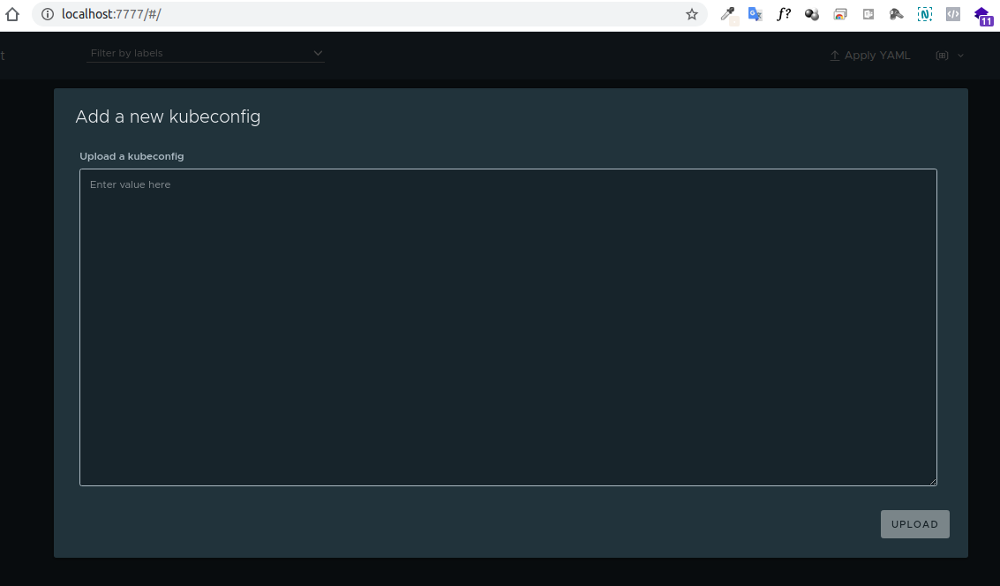
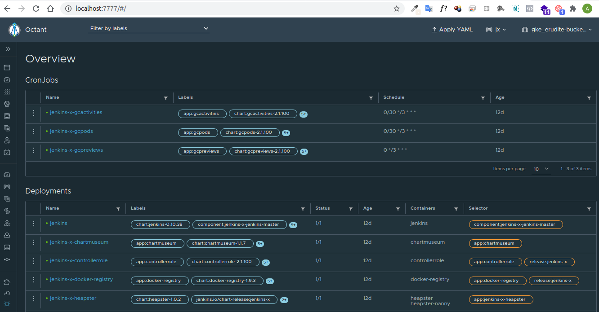

# Octant + JenkinsX

Gerenciando o cluster kubernetes + Jenkinsx + Octant

**Efetuando download:**

    wget https://github.com/vmware-tanzu/octant/releases/download/v0.14.1/octant_0.14.1_Linux-64bit.deb

Instalação do pacote:

    dpkg -i octant_0.14.1_Linux-64bit.deb

Instalação do plugin Octante para Jenkinsx

**Linux**

    mkdir -p  ~/.config/octant/plugins

    curl -L https://github.com/jenkins-x/octant-jx/releases/download/v0.0.23/octant-jx-linux-amd64.tar.gz | tar xzv

**Output:**

        % Total    % Received % Xferd  Average Speed   Time    Time     Time  Current
                                        Dload  Upload   Total   Spent    Left  Speed
        100   641  100   641    0     0   4546      0 --:--:-- --:--:-- --:--:--  4546
        0     0    0     0    0     0      0      0 --:--:-- --:--:-- --:--:--     0LICENSE
        README.md
        changelog.md
        octant-jx
        19 39.3M   19 7928k    0     0  3233k      0  0:00:12  0:00:02  0:00:10 4078koctant-jxo
        100 39.3M  100 39.3M    0     0  9395k      0  0:00:04  0:00:04 --:--:-- 10.4M

Mover os binários para o diretório de configuração do usuário:

    mv octant-* ~/.config/octant/plugins/

**Inicializando a interface:**

    octant --browser-path="/#/jx/pipelines"

**Output:**

    2020-08-08T15:23:15.914-0300	INFO	dash/dash.go:105	no valid kube config found, initializing loading API
    2020-08-08T15:23:15.914-0300	INFO	dash/dash.go:140	waiting for kube config ...
    2020-08-08T15:23:15.922-0300	INFO	dash/dash.go:497	Dashboard is available at http://127.0.0.1:7777

    2020-08-08T15:23:16.299-0300	WARN	dash/dash.go:512	unable to open browser: exit status 3
    github.com/vmware-tanzu/octant/pkg/dash.(*dash).Run
        /__w/octant/octant/pkg/dash/dash.go:512
    github.com/vmware-tanzu/octant/pkg/dash.(*Runner).Start.func1
        /__w/octant/octant/pkg/dash/dash.go:130

Acessando o dashboard conforme Url informada na saída do comando de inicialização:

> http://127.0.0.1:7777 

Será solicitada a importação do arquivo de configuração do seu cluster kubernetes (kubeconfig).

Você pode obter as configurações executando o comando:

    kubectl config view --minify --raw

Copie e cole no campo de upload kubeconfig e clique em upload.

